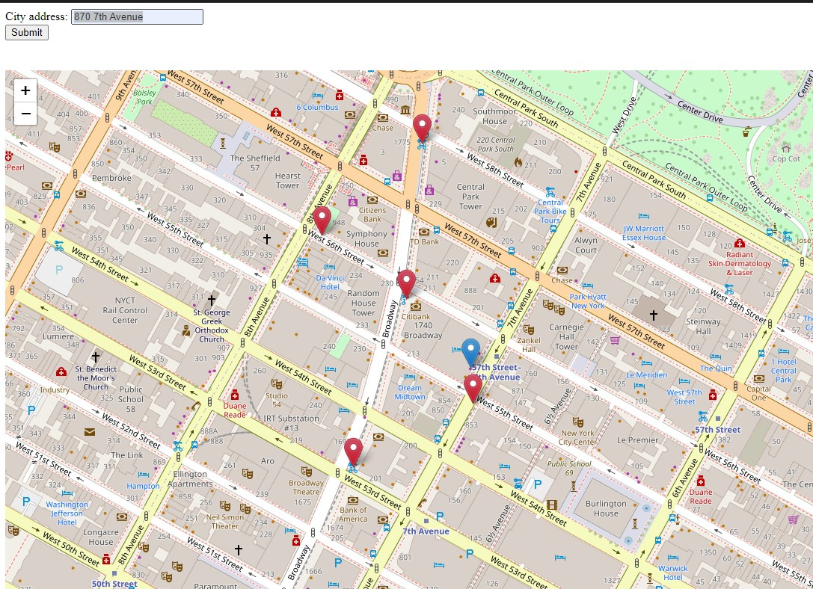

# bike-locator

Minimal web app that gets data from the Citi Bike API (status and location of every Citi Bike station in NYC). That data is stored in a Postgres DB, and the app then allows the user to enter a street address (in NYC) to find five Citi Bike stations that have available capacity. It displays the entered location and the five stations on a map. A Sunday afternoon BVP ("Barely Viable Product"), but still "full stack" (Python, Flask, and Postgres backend; JavaScript and HTML front end).

The main purpose was to just try out web app and DB deployment on Render's cloud application service (render.com). 
